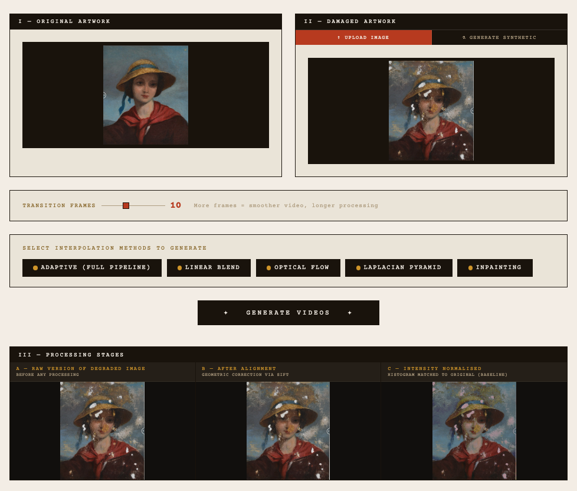
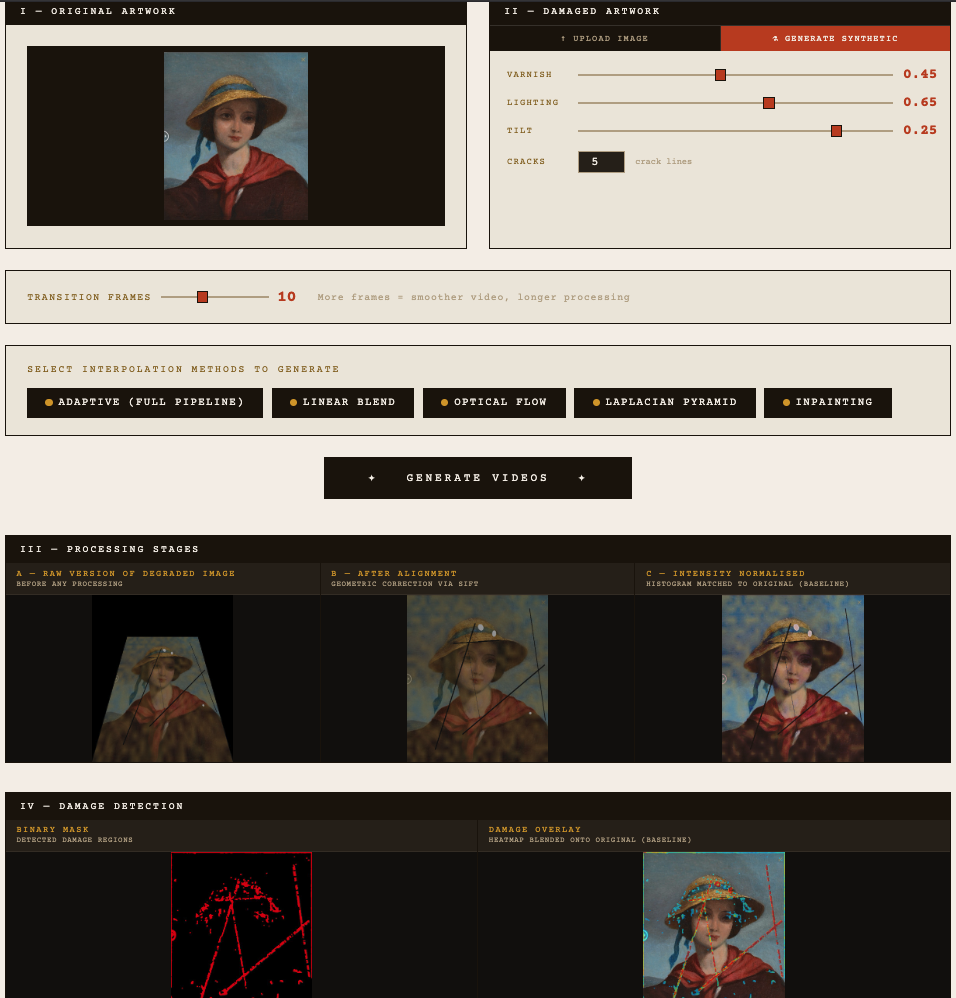
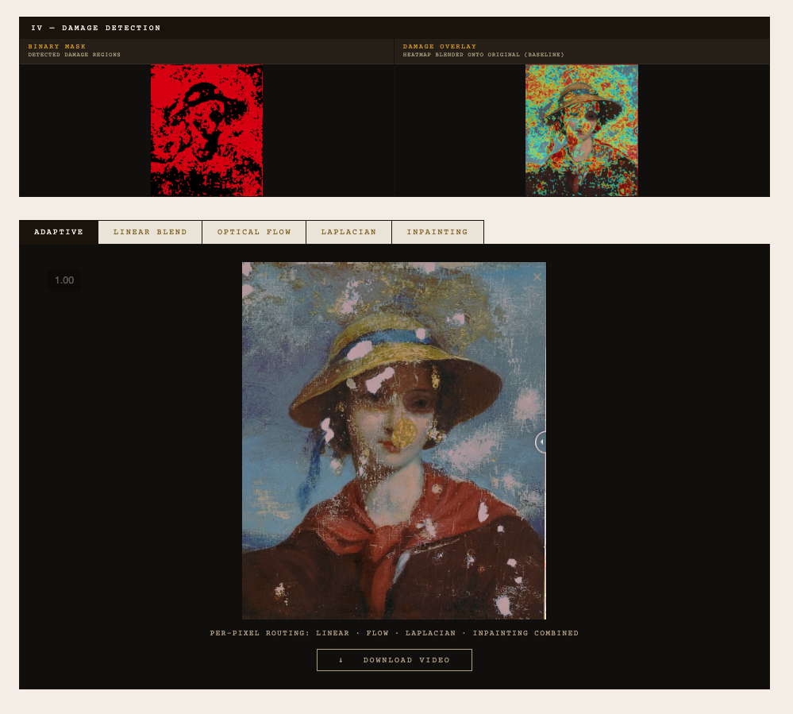

# Computer Vision Project

This project is a computer-vision based framework that compares original and degraded artwork images to systematically detect and analyze surface damage. It features a web application that aligns the images, identifies degradation, and generates temporal synthesis videos to visualize how the damage might have evolved over time.
## Prerequisites

* **Python 3.8** or higher
* **Git**

---

## Step 1 — Clone the Repository

Open your terminal and run the following command to clone the project:

```bash
git clone [https://github.com/sukibhattarai2026-arch/Computer_vision_project.git](https://github.com/sukibhattarai2026-arch/Computer_vision_project.git)
cd Computer_vision_project
```

## Step 2 — Set Up Virtual Environment

To keep dependencies isolated and avoid conflicts, create and activate a virtual environment before installing requirements:

**On macOS / Linux:**
```bash
python3 -m venv .venv
source .venv/bin/activate
```

**On Windows:**
```bash
python -m venv .venv
.\.venv\Scripts\activate
```

## Step 3 — Install Dependencies

Once the virtual environment is activated, install the required packages:

```bash
pip install --upgrade pip
pip install -r requirements.txt
```

---

## Step 4 — Project Structure

```text
Computer_vision_project/
├── app.py             # Runs the Flask web server
├── pipeline.py        # Core project logic and processing
├── images/            # Sample images for testing
└── templates/
    └── index.html     # Frontend interface
```

---

## Step 5 — Run the Application

Execute the following command to start the server:

```bash
python app.py
```

After execution, the terminal should display:
> **Running on http://0.0.0.0:7860**

---

## Step 6 — Open in Browser

Open your preferred web browser (Chrome, Brave, and Edge are tested and recommended) and navigate to:

**http://localhost:7860**

---

## Step 7 — Using the App

Images to upload can be downloaded from the git repo itself under the folder name `images`.

* **Upload Images:**
    * Upload the **original artwork** image in the left panel.
    * Upload the **damaged artwork** image in the right panel.
    * *Note: Synthetic damage images can also be generated.*
* **Generate Synthetic Damage:** Adjust the toggle buttons to generate the synthetic image:
    * Varnish
    * Lighting
    * Tilt
    * Cracks
* **Adjust Settings:** Adjust the **transition-frames** slider or **synthetic damage** slider. A larger number of frames produces a smoother output video.
* **Select Interpolation Methods:**
    * **Adaptive:** Full per-pixel routing pipeline.
    * **Linear Blend:** Simple alpha blending.
    * **Optical Flow:** Motion-compensated warping.
    * **Laplacian Pyramid:** Frequency-band blending.
    * **Inpainting:** Progressive missing-region restoration.
* **Generate & Download:**
    * Click **Generate Videos**.
    * Once processing is complete, use the tabs to compare outputs from different methods.
    * Click **Download Video** to save the selected result.


## Application Screenshots






